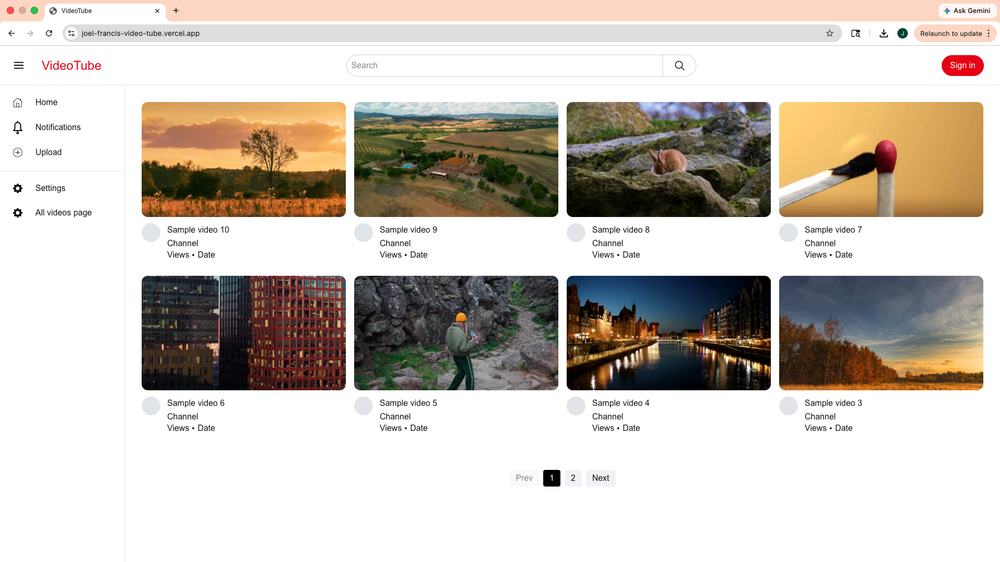

# 🎥 VideoTube

A full-stack YouTube-inspired video platform built with modern web technologies. Users can upload, browse, and watch videos through a clean, responsive interface.

## 🚀 Live Demo
👉 https://joel-francis-video-tube.vercel.app/

## 📸 Features

- 🔐 User authentication (sign up / login)
- 📤 Video upload functionality
- 🎬 Watch page with video playback
- 🔍 Search functionality for videos
- 🏠 Home feed displaying uploaded content
- 📱 Fully responsive design

## 🛠️ Tech Stack

**Frontend**
- Next.js
- TypeScript
- Tailwind CSS

**Backend**
- Supabase (Auth + Storage)
- PostgreSQL
- Prisma

## 🧠 What I Learned

- Built a full-stack application from scratch
- Implemented authentication and protected routes
- Managed relational data using PostgreSQL and Prisma
- Designed backend architecture for handling video data
- Created a responsive UI using Tailwind CSS

## ⚙️ Getting Started

### 1. Clone the repository
```bash
git clone https://github.com/joelfrancis8900/video-tube.git
cd video-tube
```

### 2. Install dependencies
```bash
npm install
```

### 3. Set up environment variables

Create a `.env` file in the root directory and add the following:

```env
DATABASE_URL=
NEXT_PUBLIC_SUPABASE_URL=
NEXT_PUBLIC_SUPABASE_PUBLISHABLE_KEY=
SUPABASE_SECRET_KEY=
```

### 4. Run the development server
```bash
npm run dev
```

## 📁 Project Structure

```
/app        → Next.js app router pages
/components → Reusable UI components
/lib        → Database & utility functions
/prisma     → Prisma schema
```

## 🚧 Future Improvements

- 💬 Comments section
- 👍 Like / dislike system
- 📊 View count tracking
- 🎯 Video recommendation system
